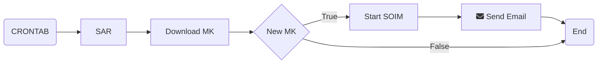

# SOIM Auto Runner


## Install

1. clone the repository:

```console
git clone git@github.com:RomoloPoliti-INAF/soimAuto.git
```

2. Install the dependencies

```console 
python3 -m pip install -Ur requirements.txt
```

Now you can run the software

## Usage

The basic usage of the code is 

```console
python3 -m SAR
```

### Options

+ *-k*, *--kernel*: This option allows you to specify the folder where SPICE kernels will be stored. Kernels are often fundamental components in various computational processes.  **Default:** *kernels*

Example:

```console
python -m SAR -k /path/to/kernels
```

+ *-d*, *--debug*: The debug option is designed to facilitate debugging during script execution. **Default:** *False*.

- Example:
```console
python -m SAR -d
```

+ *-v*, *--verbose*:  The verbose option enhances the script's output by increasing the verbosity level. You can use it multiple times to increase verbosity.

Example:
```console
python -m SAR -vv
```

+ *-V*, *--version*:  This option provides a convenient way to check the version of your script.

 Example:

```console
python -m SAR --version
```

#### Complete Example

```console
python -m SAR -k /path/to/kernels -d -vv
```
This example sets the kernels folder to "/path/to/kernels," enables debugging mode, and sets verbosity level to the maximum. Adjust the options based on your needs.

 The help documentation for the program, providing information on available options and their usage can be obtained using the option *-h* or *--help*.

## How it works

